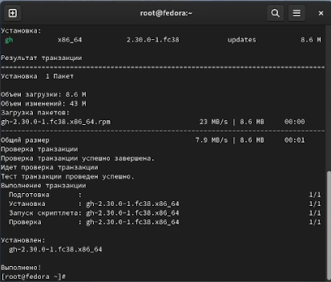
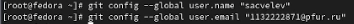
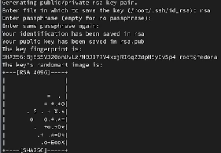
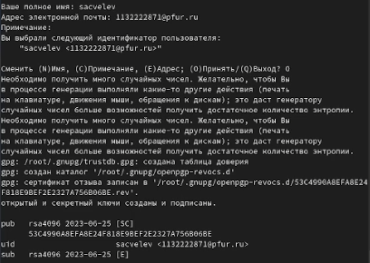
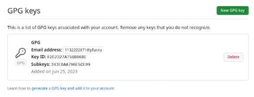
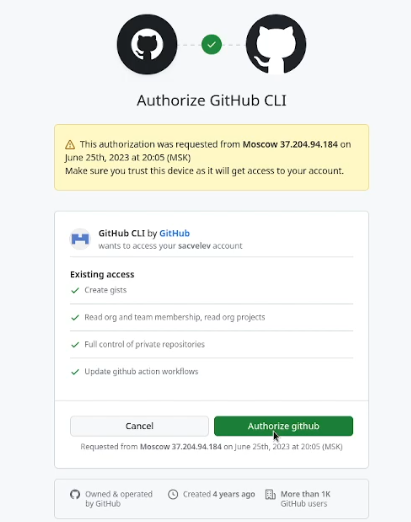
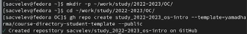
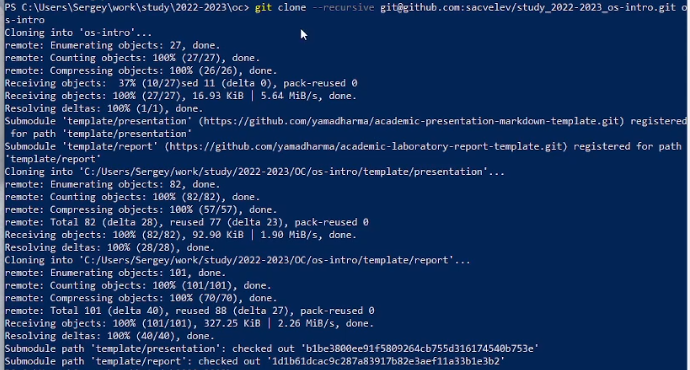
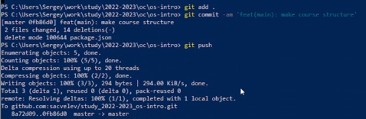

---
## Front matter
lang: ru-RU
title: Лабораторная работа №2
subtitle: Первоначальная настройка git
author:
  - Цвелев С.А.
institute:
  - Российский университет дружбы народов, Москва, Россия
date: 20 июня 2023

## i18n babel
babel-lang: russian

## Formatting pdf
toc: false
toc-title: Содержание
slide_level: 2
aspectratio: 169
section-titles: true
theme: metropolis
header-includes:
 - \metroset{progressbar=frametitle,sectionpage=progressbar,numbering=fraction}
 - '\makeatletter'
 - '\beamer@ignorenonframefalse'
 - '\makeatother'
---

# Информация

## Докладчик

:::::::::::::: {.columns align=center}
::: {.column width="70%"}

  Цвелев Сергей Андреевич

  НПИбд-02-22

  РУДН

:::
::: {.column width="30%"}

:::
::::::::::::::

# Цель работы

Изучить идеологию и применение средств контроля версий. Освоить умения по работе с git.

# Выполнение лабораторной работы
## Установка gh

(#fig:001 width=70%) 

## Задаём имя и email владельца

(#fig:002 width=70%)

## Создаём SSH-ключ

(#fig:003 width=70%)

## Создаём PGP-ключ

(#fig:004 width=70%)

## Добавляем PGP-ключ на GitHub

(#fig:005 width=70%)

## Авторизация gh через браузер

(#fig:006 width=70%)

## Создание репозитория на основе шаблона

(#fig:007 width=70%)

## Копирование репозитория на устройство

(#fig:008 width=70%)

## Отправка файлов репозитория на сервер

(#fig:009 width=70%)

# Вывод

Я приобрёл практические навыки установки и настройки ОС на виртуальную машину.
