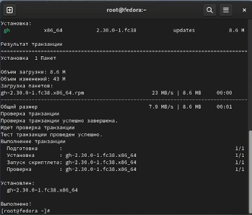
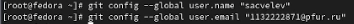
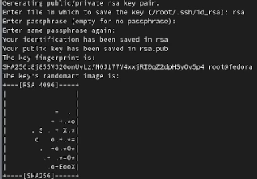
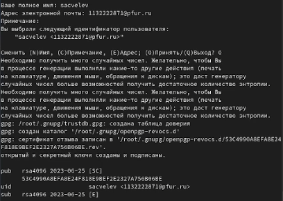
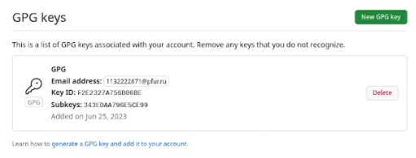
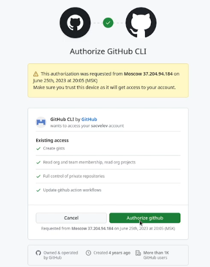
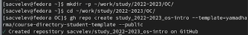
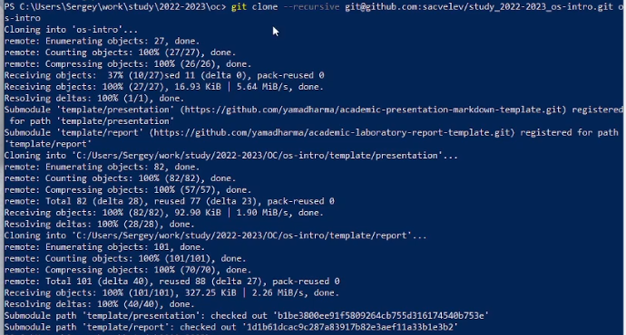
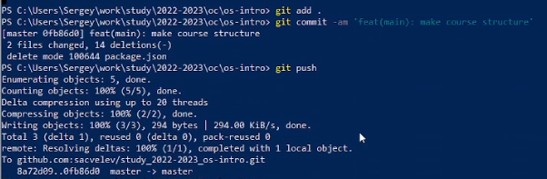

---
## Front matter
title: "Отчёт по лабораторной работе 2"
subtitle: "Первоначальная настройка git"
author: "Цвелев Сергей Андреевич"

## Generic otions
lang: ru-RU
toc-title: "Содержание"

## Bibliography
bibliography: bib/cite.bib
csl: pandoc/csl/gost-r-7-0-5-2008-numeric.csl

## Pdf output format
toc: true # Table of contents
toc-depth: 2
lof: true # List of figures
lot: true # List of tables
fontsize: 12pt
linestretch: 1.5
papersize: a4
documentclass: scrreprt
## I18n polyglossia
polyglossia-lang:
  name: russian
  options:
	- spelling=modern
	- babelshorthands=true
polyglossia-otherlangs:
  name: english
## I18n babel
babel-lang: russian
babel-otherlangs: english
## Fonts
mainfont: PT Serif
romanfont: PT Serif
sansfont: PT Sans
monofont: PT Mono
mainfontoptions: Ligatures=TeX
romanfontoptions: Ligatures=TeX
sansfontoptions: Ligatures=TeX,Scale=MatchLowercase
monofontoptions: Scale=MatchLowercase,Scale=0.9
## Biblatex
biblatex: true
biblio-style: "gost-numeric"
biblatexoptions:
  - parentracker=true
  - backend=biber
  - hyperref=auto
  - language=auto
  - autolang=other*
  - citestyle=gost-numeric
## Pandoc-crossref LaTeX customization
figureTitle: "Рис."
tableTitle: "Таблица"
listingTitle: "Листинг"
lofTitle: "Список иллюстраций"
lotTitle: "Список таблиц"
lolTitle: "Листинги"
## Misc options
indent: true
header-includes:
  - \usepackage{indentfirst}
  - \usepackage{float} # keep figures where there are in the text
  - \floatplacement{figure}{H} # keep figures where there are in the text
---

# Цель работы

Изучить идеологию и применение средств контроля версий. Освоить умения по работе с git.

# Выполнение лабораторной работы

Устанавливаем git и gh (рис. @fig:001). Git в моем был уже установлен предварительно.

(#fig:001 width=70%) 

Далее, проводим базовую настройку git. На изображении ниже (рис. @fig:002) - задаем имя и email владельца репозитория.

(#fig:002 width=70%)

Создаём SSH-ключ (риc. @fig:003). Мною была допущена ошибка, когда я проводил эту операцию на root-пользователе. После окончания работы ошибка была исправлена.

(#fig:003 width=70%)

Затем, создаём PGP-ключ (рис. @fig:004). 

(#fig:004 width=70%)

Затем мы добавляем PGP-ключ в GitHub (рис. @fig:005).

(#fig:005 width=70%)

Далее мы настраиваем gh. Выбираем нужные нам параметры. Авторизовываемся с помощью браузера (рис. @fig:006).

(#fig:006 width=70%)

Далее мы создадим репозиторий курса на основе шаблона (рис. @fig:007). Этот репозиторий у меня уже был, но я создал ещё один для лабораторной работы.

(#fig:007 width=70%)

После этого мы копируем этот репозиторий на устройство (рис. @fig:008). Из-за вышеупомянутой ошибки я не мог скопировать его и смог только после завершения лабораторной работы. Альтернативным решением было продолжить это на моем Windows, а не виртуальной Fedora.

(#fig:008 width=70%)

Переходим в каталог курса, удаляем лишний файл package.json и создаем необходимые каталоги. После этого мы отправляем файлы на сервер (рис. @fig:009).

(#fig:009 width=70%)

На этом настройка git была завершена.

# Ответы на контрольные вопросы

Что такое системы контроля версий (VCS) и для решения каких задач они предназначаются?

Программное обеспечение для работы с постоянно изменяющейся информацией. Позволяет хранить несколько версий одного и того же документа, с возможностью возвращаться к ранним его версиям.

Объясните следующие понятия VCS и их отношения: хранилище, commit, история, рабочая копия.

Хранилище - место хранение всех версий. Commit - новая версия. История - история изменений. Рабочая копия - текущая версия.

Что представляют собой и чем отличаются централизованные и децентрализованные VCS? Приведите примеры VCS каждого вида.

Централизованные VCS имеют единое хранилище для всех версий (CVS, Subversion). Децентрализованные имеют каждое хранилище на каждую версию (Git, Mercurial).

Опишите действия с VCS при единоличной работе с хранилищем.

Пользователь размещает новую версию, а может и вернуться к прошлым.

Опишите порядок работы с общим хранилищем VCS.

Общее хранилище работает с несколькими пользователями.

Каковы основные задачи, решаемые инструментальным средством git?

Git помогает работать над кодом в команде и хранит информацию об изменениях.

Назовите и дайте краткую характеристику командам git.

add - добавляет содержимое в индекс, rm - удаляет содержимое из индекса, commit - сохраняет изменения, mv - перемещение, clean - очищение, push - отправка на сервер

Приведите примеры использования при работе с локальным и удалённым репозиториями.

Отчёт по лабораторной отправляется сначала в локальный репозиторий, а после отправляется в удалённый

Что такое и зачем могут быть нужны ветви (branches)?

Ветки разделяют проект на несколько частей, чтобы несколько пользователей работали над проектом и не влезали в ветки друг друга

Как и зачем можно игнорировать некоторые файлы при commit?

commit нужно делать не со всеми файлами, а только с теми, которые были изменены или добавлены в ходе работы.

# Выводы

Я научился проводить первоначальную настройку git и освоил умения по работе с ним.

